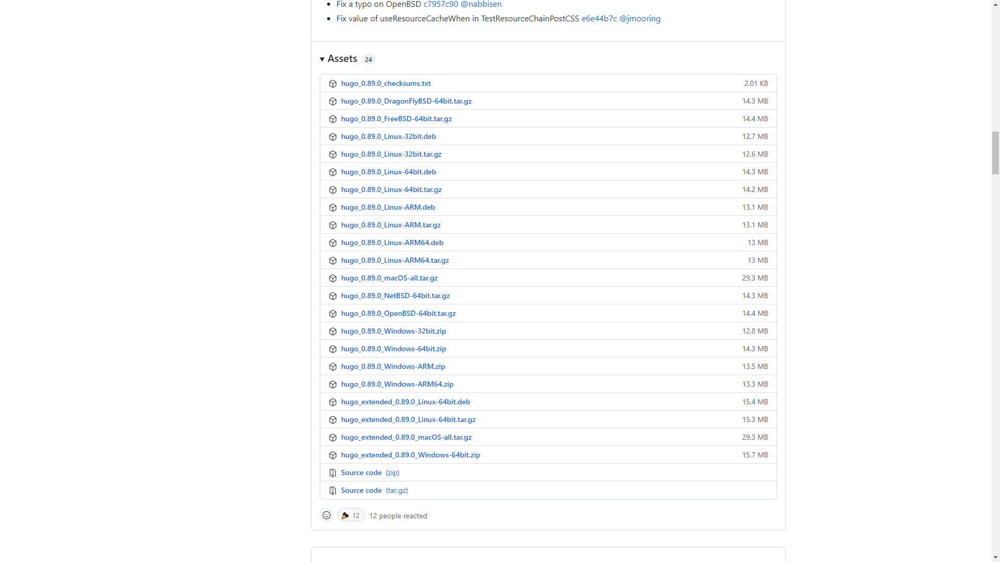

---
## Hugoとは
オープンソースの静的サイトジェネレーターです。　[<span style="color:skyblue">Hugoホームページ</span>](https://gohugo.io/)  
動的サイト？静的サイト？などの話は置いておいて、Hugoで何が出来るのかというと、

「**MarkdownファイルからHTMLファイルを自動的に生成**」出来るようになります。

なぜわざわざHugoを使ってHTMLファイルを作るのか。Hugoが選ばれる理由はいくつかあると思いますが、

- コンテンツを全てファイルで管理できる（データベース不必要）
- 多くの公開テーマを利用できる
- 拡張性が高い
- 静的サイトジェネレーターの中でかなり高速らしい

この辺りが自分がHugoを選んだ理由です。

見た目のいいサイトを作りたい！でもHTMLとかCSSを０から学ぶのは大変…  
じゃあそこはHugoに丸投げしちゃって、自分はMarkdownで記事を書くことだけに集中しよう！
あとはヨロシク！こんなことが出来ちゃうのが「Hugo」です。すごいね。

---
## Hugoのインストール
インストールってよく分からんし…　なんとHugoのインストールはとても簡単です。  
[<span style="color:skyblue">https://github.com/gohugoio/hugo/releases</span>](https://github.com/gohugoio/hugo/releases)からバイナリファイルをダウンロードして展開するだけです。詳しく説明していきます。

上記サイトにアクセスしたら、自分の環境に合ったものをダウンロードしましょう。
extendedというのは「Sass」や「SCSS」を使う際に選ぶ必要があるものです。
何それ？という方はextendedでは無い方を選んでおきましょう。  
自分の環境では、「*hugo\_(ver.)_Windows-64bit.zip*」をダウンロードしました。  
ただし、テーマによってはextended必須のものもあるらしい。



ダウンロード出来たら中身を適当なディレクトリに展開します。


Cドライブ直下に「Hugo」という作業用フォルダを作り、そこに展開しました。  
ここまで来たらあと一息です！  
中に「bin」というフォルダがあるか確認しておきましょう。
```md {linenos = false}
hugo_(ver.)_Windows-64bit
|-bin
|   -hugo.exe
|   -LICENSE
|   -README.md
```

---
## 環境変数の設定
ダウンロードが済んだらPathを通しましょう。  
「コントロールパネル」を開いて、「システム」→「システムの詳細設定」から  
「環境変数」を開きます。  
または、「Windowsスタートメニュー」を右クリックし「ファイル名を指定して実行」
「sysdm.cpl」→「詳細設定」→「環境変数」でも開けます。（豆知識）


「Path」を選んで「編集」します。


「新規」からこのようにPathの設定が出来ればOK！  
先ほど確認した「bin」までのPathです。

---
## 動作確認
では最後に動作確認をしておきましょう。
コマンドプロンプトを開き、`hugo help`を実行します。


このようにヘルプが表示されていれば、正常にインストール出来ています。

---
[Hugoによるサイト作りシリーズ](../../../series/hugoによるサイト作り)
