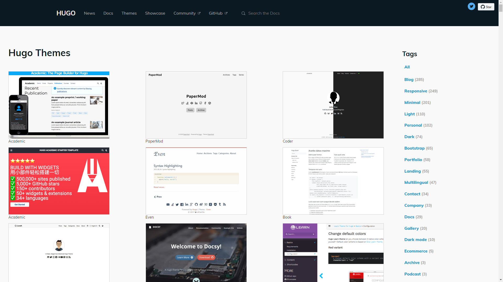
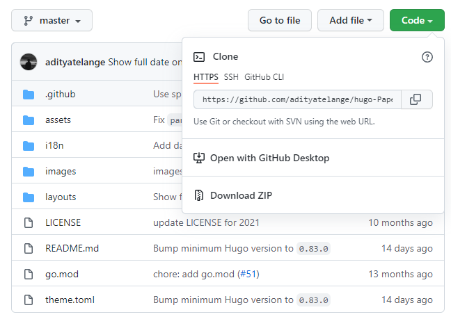
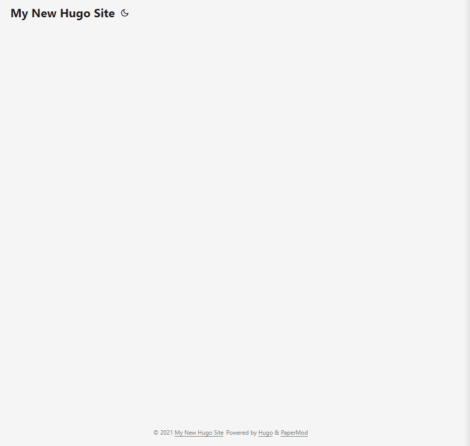
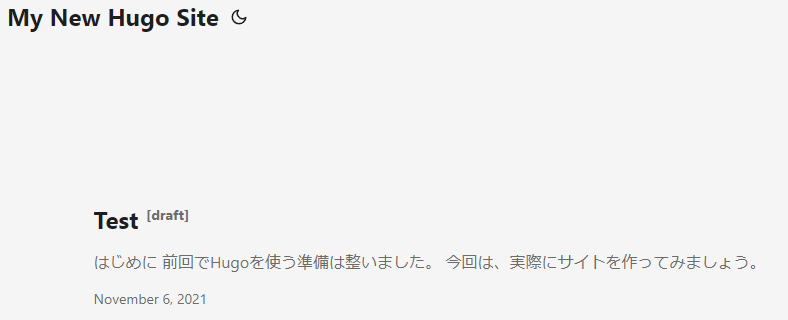
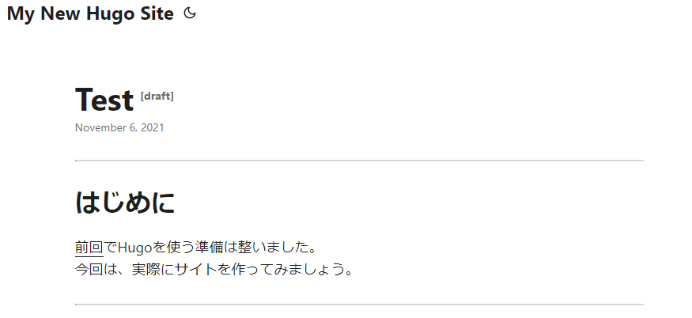
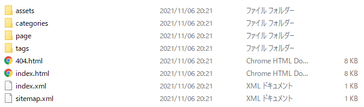

---
## はじめに
[前回](../1/)でHugoを使う準備は整いました。  
今回は、実際にサイトを作ってみましょう。

---
## サイトの作成
Hugoの作業用フォルダに、サイト用のフォルダ「Sites」を作ります。
```md {linenos=false}
Hugo
|   -hugo_(ver.)_Windows-64bit
|    |   -bin
|    |    |   -hugo.exe
|    |    |   -LICENSE
|    |    |   -README.md
|    |
|   -Sites
```
Hugoの操作は「コマンドプロンプト」から行います。  
まずは`cd`でカレントディレクトリを「Sites」に変更します。`cd C:/Hugo/Sites`

サイトを作成するときは`hugo new site サイト名`を実行します。  
すると現在のディレクトリに「サイト名」のフォルダが生成されます。  
サイト名は何でもいいですが、ここでは「MySite」とします。  
では実行してみます。`hugo new site MySite -f yml`

急に`-f yml`って変なのがくっついてる！と思うでしょうが焦らないで下さい。  
これはサイト生成のオプションを付け足しただけです。  
意味は「サイトの設定を記述するconfigファイルをYML形式にしてね」です。

テーマによってconfigファイルの形式が違います。これから例に説明する「PaperMod」という
テーマがYML形式だったのでこのオプションを付けています。[<span style="color:skyblue">hugo new site</span>](https://gohugo.io/commands/hugo_new_site/)  
[後で](./#補足configファイルの形式)詳しく説明するので、今はなんとなく読み飛ばして下さい。
```md {linenos=false}
Sites
|   -MySite
|    |   -archetypes
|    |   -content
|    |   -data
|    |   -layouts
|    |   -static
|    |   -themes
|    |   -config.yml
```
たったこれだけでサイトが出来ました。  
「MySite」以下に生成されたファイル群の概要は次の通りです。[<span style="color:skyblue">Directory Structure</sapn>](https://gohugo.io/getting-started/directory-structure/)
### archetypes
`hugo new`コマンドでコンテンツを作成するときのアーキタイプを格納するディレクトリ
### content
コンテンツを格納するディレクトリ。ここで記事を作る。
### data
色々なデータを保存するディレクトリ。
### layouts
HTML生成時のレイアウト設定などのテンプレートを格納するディレクトリ。
### static
画像、CSS、JavaScriptなどのすべての静的コンテンツを格納するディレクトリ。
### themes
テーマを格納するディレクトリ。
### config.yml
サイトの様々な設定を記述するファイル。形式はtomlかymlかjson

あとは基本的には**content以下でMarkdownを書く**だけで記事を作っていけます。  
他のディレクトリはサイトを細かくカスタマイズしていく際に触ってみてください。  
ひとまずこれでサイトの作成が出来ました！

---
## テーマの適用
次はテーマを選びましょう。Hugoには様々なテーマが公開されています。  
[<span style="color:skyblue">Hugo Themes</span>](https://themes.gohugo.io/)を訪れて、好みのテーマを選びましょう！



魅力的なテーマが多くてなかなか決められませんね。笑

<span style="color:#FF6600">ここで１つテーマ選びで大切なことがあります。</span>  
**Hugoのテーマで決まるのはデザインだけではない**ということです。  
サイトの機能面もテーマによって決まります。正確には、**初めから提供されている機能がテーマによって違います**。例えば、最終更新日の表示、カテゴリー別表示、検索機能などです。

Hugoには、最終更新日の設定や、タグ・カテゴリーといった機能自体は存在します。  
しかし、それをサイトに反映しようと思うと自分で実装しなくてはなりません。  
これは、設定ボタンON！OFF！みたいに簡単にはいきません。

Hugoに慣れてきたら自分でカスタマイズして追加も出来ますが、初心者にはハードルが高く時間もかかるでしょう。なので、**ある程度は機能面も考慮して**テーマを選ぶのが良いでしょう。

良さそうなテーマを見つけたら「demo」や「example」と書かれた場所から**デモサイト**を見ることが出来ます。特徴を文字で説明されても何のことかよく分からないでしょう。実際にデモサイトを触ってみることをおすすめします。

ここでは「PaperMod（[<span style="color:skyblue">デモサイト</span>](https://adityatelange.github.io/hugo-PaperMod/)）」というテーマを例に説明していきます。  
このサイトもPaperModを使用しています。

### テーマのダウンロード
テーマを決めたらありがたく使わせて頂きます。ダウンロードしましょう。  
Downloadをクリックし、GitHubに移動したら、<span style="color:green">**code**</span>からzipをダウンロードします。



中身を展開し、MySite/themes 以下に配置しましょう。この時、フォルダ名を  
「hugo-PaperMod_master」から「hugo-PaperMod」に変更してください。
```md {linenos=false}
MySite
|   -archetypes
|   -content
|   -data
|   -layouts
|   -static
|   -themes
|    |   -hugo-PaperMod
|   -config.yml
```

### configファイルの設定
ダウンロードが済んだら、サイトにテーマ適用の設定をします。configファイルをテキストエディタで開きます。
```yml {}
baseURL: http://example.org/
languageCode: en-us
title: My New Hugo Site
```
ここにthemeの記述を追加します。
```yml {hl_lines=[4]}
baseURL: http://example.org/
languageCode: en-us
title: My New Hugo Site
theme: hugo-PaperMod
```
これでテーマの適用が完了しました。簡単！

### （補足）configファイルの形式
Hugoではサイト設定ファイルであるconfigの形式を、「toml」か「yml」か「json」で記述することになっています。デフォルトでは「toml」です。[<span style="color:skyblue">Configure Hugo</span>](https://gohugo.io/getting-started/configuration/)  
**何が違うかというと、文法が違うだけです。**  
これからテーマとconfigをカスタマイズするにあたって、テーマが公開しているデモサイトのconfigファイルを参考にしたりコピーしたりします。この時、文法の違いを気にしたくないですし、それが原因のエラーも起こしたくありません。  
テーマが使う形式に合わせておけば何かと分かりやすいので、[サイト生成時](./#サイトの作成)に`-f yml`をオプション設定しました。理由はたったこれだけです。

---
## ローカルでプレビュー表示
ここまでで、テーマの適用が出来たサイトが生成されています。でも実際に見てみないと上手くいっているかわかりませんよね？Hugoにはサーバー機能があります。  
コマンドプロンプトで`cd C:/Hugo/Sites/MySite`でカレントディレクトリを「MySite」に変更し`hugo server`を実行してみましょう。  
上手くいっていれば、ブラウザで http://localhost:1313/ にアクセスするとサイトを見ることが出来ます。

まだ記事が無いので、恐らく真っ白です。笑  
このように表示されていればテーマの適用が出来ています。



確認出来たら一旦停止させましょう。コマンドプロンプトで Ctrl + C で停止です。

---
## 記事の作成
では試しに記事を１つ作成しましょう。コマンドプロンプトで`hugo new ファイル名`を実行します。この時ディレクトリも同時に指定出来ます。では、`hugo new posts/test.md`を実行してみましょう。
```md {linenos=false}
MySite
|   -archetypes
|   -content
|    |   -posts
|    |    |   -test.md
|    |
|   -data
|   -layouts
|   -static
|   -themes
|    |   -hugo-PaperMod
|   -config.yml
```
このようにcontent以下に新しくファイルが生成されます。ディレクトリが無かった場合は自動的に作ってくれます。test.mdの中身を見てみましょう。
```yml {}
---
title: "Test"
date: 2021-11-06T12:28:59+09:00
draft: true
---


```
この\-\-\-で囲まれている部分は「フロントマター」といいます。ここに記事ごとの設定を記述出来ます。設定項目は[<span style="color:skyblue">Front Matter</span>](https://gohugo.io/content-management/front-matter)に詳細があります。

では7行目から記事の本文を書いていきましょう。以下のように記述します。
```md {linenostart=7}
---
## はじめに
前回でHugoを使う準備は整いました。  
今回は、実際にサイトを作ってみましょう。

---
```
このページの実際の書き出しです。書けたら変更を保存し、サーバーを起動しましょう。  
`hugo server`です。覚えていましたか？

どうでしょうか？白紙のトップページのままですね。なぜかというと、フロントマターのdraftがtrueになっている（つまり、下書きに設定されている）からです。

コンテンツを表示するには、「draftをfalseにする」または「`hugo server -D`でサーバーを起動する」のどちらかが必要です。`-D`というのはオプション設定で、意味は「下書きのコンテンツもビルドする」です。[<span style="color:skyblue">hugo server</sapn>](https://gohugo.io/commands/hugo_server)

コンテンツ製作中は`hugo server -D`でサイトを確認し、完成したらdraftをfalseにするのが良いと思います。では`hugo server -D`を実行してみましょう。




テーマのカスタマイズはしていないので、本サイトと細かいデザインの違いはありますが、ちゃんと記事が出来ています！

---
## 静的ファイルを出力する
せっかく記事を作ったのにローカル環境で`hugo server`実行中しか見られないのは寂しいですよね。サーバーを起動してサイトやページに問題がなければ、`hugo`コマンドを実行しましょう。  
`hugo`を実行すると、MySiteにpublicディレクトリが生成され、その下にHTMLなどの静的ファイルが出力されます。



ただし、draftがtrueのコンテンツはビルドされません。なので記事が完成したらdraftをfalseにして`hugo`を実行するという流れが良いでしょう。

publicフォルダをまるごとサーバーにアップすればサイトを公開できます。  
このサイトはGitHub Pagesで公開していますが、ホスティングの方法は色々あるようです。[<span style="color:skyblue">Hosting & Deployment</span>](https://gohugo.io/hosting-and-deployment/)  
GitHub Pagesでの公開は[次回](../3/)説明します。

---
[Hugoによるサイト作りシリーズ](../../../series/hugoによるサイト作り)
